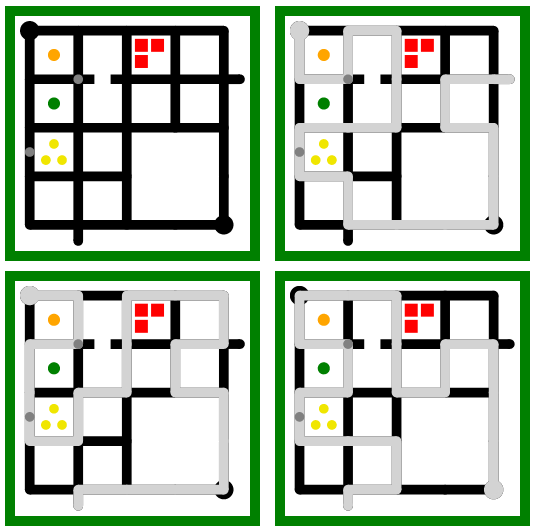

## An ASP-based solver for The Witness puzzles

Puzzles can be specified in ASP-syntax, solutions are rendered in SVG.

This model requires the ASP solver [clingo](https://potassco.org/).

### supported constraints:

- line from start to finish
- some nodes on the grid do not exist
- some paths on the grid are blocked, i.e. not usable
- black dots on a line segment
- black dots on a node/crossing
- yellow triangles on a block
- colored dots on blocks
- tetromino-like shapes on blocks

### Work in Progress

- ...
